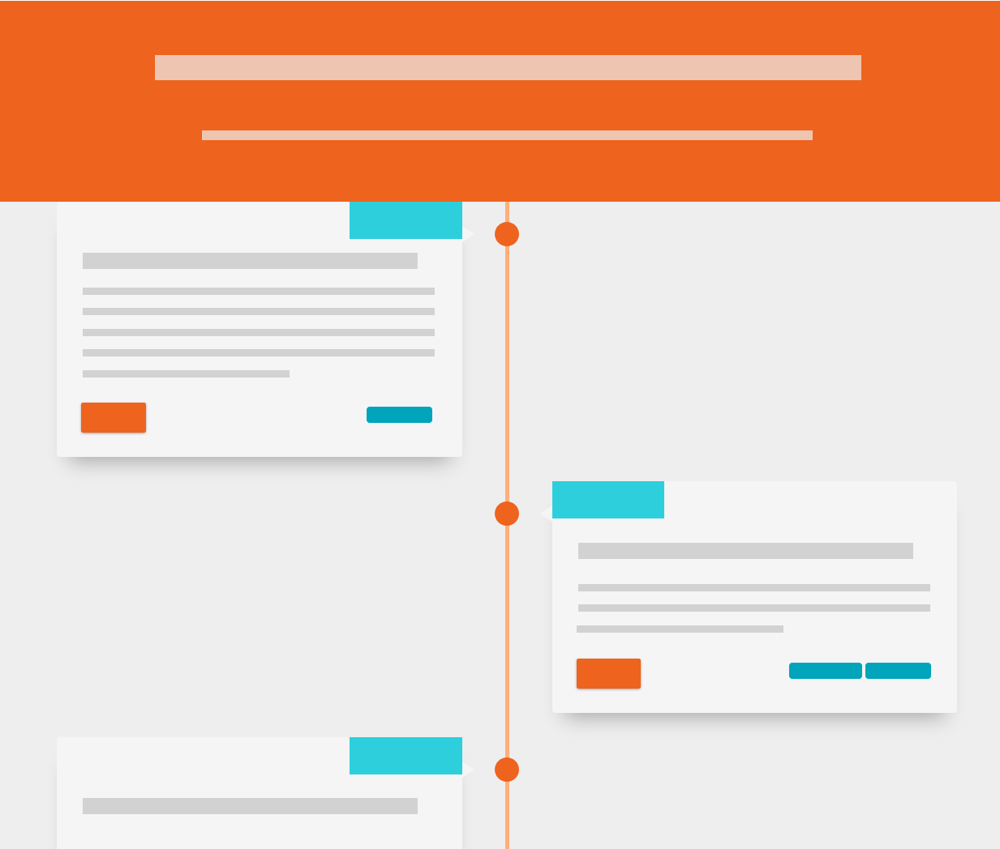

# OSVQ

[](https://www.python.org/)
[](https://twitter.com/pg3io/)


## Introduction
OSVQ est un Frontend d'un calendrier Google Agenda. Le projet vient du besoin de centraliser sur une page web des événements de différentes provenances : Meetup, EventBrite, Facebook, Linkedin, etc. Le choix d’un agenda en backend a été fait pour la simplicité d’ajout de contenu ainsi que la gestion/délégation des droits.



## Fonctions
* Backend Google Agenda
* Gestion de label personnalisé dans le champ description (tags, city, url, webinar)
* Sites web minimaliste timeline
* YAML de configuration
* Gestion tag Google Analytics

**À venir**
- [x] Gestion tag Google Analytics
- [ ] Filtrage par tags
- [ ] Événement passé
- [ ] Page Json
- [ ] Code couleur personnalisé
- [ ] Autre backend (Caldav)
- [ ] Templating web
- [ ] Cache du backend (afin de limiter les appels vers l'API Google)
- [ ] ~~Flux RSS~~
- [ ] Exposition d'un CalDav en lecture seule

## Démarrage rapide
Créer votre API token Google Calendar (https://developers.google.com/calendar/quickstart/python)

```bash
mkdir data
cp config.example.yaml config.yaml
vi config.yaml # update parametre
cp credentials.example.json credentials.json
vi credentials.json # update parametre
```

### Python
```bash
pip install -r requirements.txt
export FLASK_APP=app.py
flask run
```

### Docker

```bash
docker build -t pg3io/osvq .
mkdir data
docker run -d -p 5000 -v ${PWD}/data:/app/data -v ${PWD}/config.yaml:/app/config.yaml -v ${PWD}/credentials.json:/app/credentials.json pg3io/osvq
```

# Contributeurs

* Template base : Vertical Timeline - By Sava Lazic - https://codepen.io/savalazic/full/QKwERN https://codepen.io/savalazic
* Icône : Font Awesome - https://fontawesome.com/
* Google Calendar API : Python Quickstart - https://developers.google.com/calendar/quickstart/python

# License
Ce projet est sous licence [Apache 2.0](https://www.apache.org/licenses/LICENSE-2.0) consulter le fichier [LICENSE](LICENSE) pour plus de détails.

# Informations sur l'auteur
Ce projet a été créé par [PG3](https://pg3.io) en janvier 2020. 
